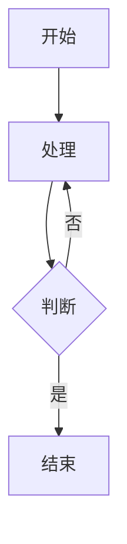

# Markdown2HTML

轻量,美观的浏览器端 Markdown 转 HTML 转换器,从 vscode-markdown-pdf 项目中提取的核心转换功能。

## 📖 背景

随着大语言模型的普及,Markdown 已成为内容创作的首选格式。它让我们能够用纯文本快速产出格式规范、美观大方的文档,极大地提升了写作效率。

然而在实际使用中,将 Markdown 转换为可分享的文档格式时,现有方案往往存在诸多不便:

- **vscode-markdown-pdf** - 功能强大但配置复杂,CSS 自定义有一定门槛,且中文默认使用日文字体
- **在线转换工具** - 依赖网络,隐私性差,且样式定制受限
- **命令行工具** - 需要安装 Node.js 等环境,对非技术用户不够友好

因此,我从 vscode-markdown-pdf 项目中提取了核心转换逻辑,打造了这个**完全在浏览器端运行**的轻量级转换工具。

### 💡 适用场景

- 📄 **个人简历** - 快速生成格式统一的专业简历
- 📊 **项目文档** - 为客户提供美观的技术文档
- 📝 **技术博客** - 将 Markdown 文章导出为独立 HTML 页面
- 📚 **学习笔记** - 整理带代码高亮和图表的知识文档

**无需安装,开箱即用,完全离线,保护隐私。**

## ✨ 功能特性

- ✅ **标准 Markdown** - 完整支持 CommonMark 规范
- ✅ **代码高亮** - 基于 highlight.js,支持多种主题
- ✅ **Mermaid 图表** - 流程图、序列图等
- ✅ **PlantUML 图表** - UML 图表支持
- ✅ **Emoji 表情** - :smile: :rocket: :heart:
- ✅ **复选框** - `- [x]` 任务列表
- ✅ **自定义容器** - `:::warning` 等扩展语法
- ✅ **YAML Front Matter** - 支持元数据配置
- ✅ **自定义 CSS** - 完全自定义样式
- ✅ **实时预览** - 即时查看转换结果
- ✅ **导出 HTML** - 一键下载完整 HTML 文件
- ✅ **页面内目录** - 自动生成可点击的文档目录

## 🚀 快速开始

### 直接打开 (推荐)

1. 用浏览器直接打开 `index.html` 文件
2. 在左侧输入 Markdown 内容
3. 点击"转换"按钮查看结果

## 💻 使用方法

### 基础使用

1. **输入 Markdown** - 在左侧文本框输入 Markdown 内容
2. **自定义样式(可选)** - 在中间文本框输入自定义 CSS
3. **配置选项** - 底部工具栏勾选需要的功能
4. **点击转换** - 点击"转换"按钮或按 `Ctrl/Cmd + Enter`
5. **查看结果** - 中间面板预览,右侧查看 HTML 代码
6. **导出文件** - 点击"下载 HTML"保存文件

### 高级功能

#### Mermaid 图表




#### 自定义容器

::: warning
这是一个警告容器
:::

::: info
这是一个信息容器
:::


## 🔧 配置选项

| 选项 | 说明 | 默认值 |
|------|------|--------|
| 启用换行 | 将单个换行符转换为 `<br>` | false |
| 启用 Emoji | 支持 :emoji: 语法 | true |
| 代码高亮 | 启用代码语法高亮 | true |
| 高亮主题 | highlight.js 主题名称 | github |
| 默认样式 | 包含内置的 Markdown 样式 | true |

### 可用的代码高亮主题

常用主题: `github`, `monokai`, `atom-one-dark`, `atom-one-light`, `vs`, `vs2015`, `dracula`, `nord`, `tomorrow-night`, `solarized-dark`, `solarized-light`

完整列表: https://cdnjs.com/libraries/highlight.js

## 🎨 自定义样式

### 内联 CSS

在"自定义 CSS"文本框中直接输入样式:

```css
body {
  max-width: 900px;
  margin: 0 auto;
  font-family: 'Georgia', serif;
}

h1 {
  color: #2c3e50;
  border-bottom: 2px solid #3498db;
}

code {
  background-color: #f0f0f0;
  padding: 2px 6px;
  border-radius: 3px;
}
```

### 主题切换

修改底部的"高亮主题"输入框,支持的主题包括:

- **亮色**: `github`, `atom-one-light`, `vs`, `xcode`
- **暗色**: `monokai`, `atom-one-dark`, `vs2015`, `dracula`, `nord`


## 📝 与原项目的差异

| 特性 | vscode-markdown-pdf | 本项目 |
|------|---------------------|--------|
| 运行环境 | VSCode 扩展 (Node.js) | 纯浏览器 |
| 依赖管理 | npm | CDN |
| 文件操作 | 支持读写本地文件 | 不支持 |
| PDF 导出 | 支持 (Puppeteer) | 不支持 |
| 图片导出 | 支持 PNG/JPEG | 不支持 |
| HTML 导出 | 支持 | ✅ 支持 |
| 自定义样式 | 支持文件路径 | 支持内联 CSS |

## 🤝 贡献

本项目是从 [vscode-markdown-pdf](https://github.com/yzane/vscode-markdown-pdf) 提取的简化版本。

## 📄 许可证

遵循原项目的许可证 (MIT License)

